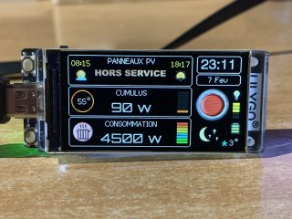
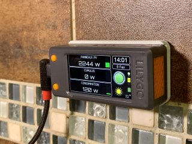

# Companion
**Afficheur déporté pour MSunPV**

  

Le Companion est un écran déporté pour suivre la production de panneaux photovoltaiques, la consommation de votre domicile et la recharge solaire de votre cumulus, ces données étant récupérées depuis un routeur solaire M'SunPV.

Cet afficheur est conçu pour être utilisé avec le LILYGO T-Display S3 et certaines bibliothèques sont nécessaires pour un fonctionnement correct sous Arduino IDE. Tous les détails sont dans cette vidéo https://youtu.be/8KDCmyMWrUk ainsi que dans le document pdf de ce repository.

Par ailleurs une clef API gratuite openweathermap.org est nécessaire (voir sur leur site). Créez un compte gratuit pour ensuite obtenir une clef API directement utilisable sur votre Companion.

**Fonctions de l'afficheur**

Cette version permer l'affichage de la production des panneaux photovoltaiques, de la recharge d'un cumulus et de la consommation totale.
Le rafraichissement des informations se fait toutes les 15 secondes. La date et l'heure sont géres automatiquement et tient compte des décalages horaires été/hiver.

Une icone vidéo vous montre le temps actuel, la température extérieure, le point de givre ainsi que les horaires du lever et coucher de soleil. Le rafraichissement des ces infos, se fait toutes les 15 minutes.

Le bouton du T-Diplay situé en bas, si vous avez branché le module par la gauche affiche les cumuls de la consommation, de la production des panneaux, de la réinjection, et de la charge du cumulus.

Le bouton haut permet de régler la luminosité de l'écran avec effet de va-et-vient et rendu graphique. La charge de la batterie éventuellement installée est visualisée également.
En cas de problème, le bouton reset situé sur le haut du boitier permet de relancer le programme.

**MSunPV**

C'est un routeur solaire permettant d'utiliser le courant normalement réinjecté dans le réseau et de l'utiliser pour recharger un cumulus, lancer une climatisation, faire fonctionner un radiateur, un moteur ou une pompe par exemple. Tous les détails sont sur le site https://ard-tek.com

