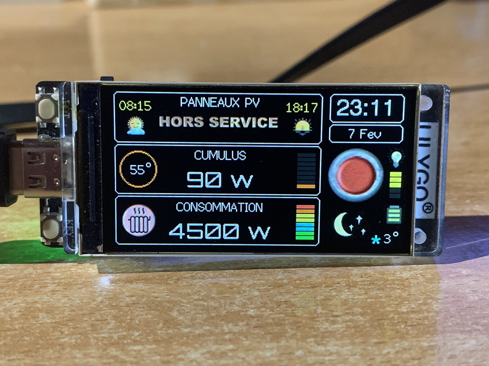

# Companion
**Afficheur déporté pour MSunPV**

Cet afficheur est conçu pour être utilisé avec le LILYGO T-Display S3 et certaines bibliothèques sont nécessaires pour un fonctionnement correct sous Arduino IDE. Tous les détails sont dans cette vidéo https://youtu.be/8KDCmyMWrUk

**TFT_eSPI.h par Bodmer**

Cette bibliothèque doit être installée dans Documents/Arduino/libraries. Dans le github https://github.com/Xinyuan-LilyGO/T-Display-S3, ce fichier est contenu dans le répertoire lib. Il suffit de la copier pour la coller dans libraries.

**Bibliothèques à installer pour la version 2**

https://github.com/PaulStoffregen/Time

https://github.com/JChristensen/Timezone

https://github.com/Bodmer/JSON_Decoder

https://github.com/Bodmer/OpenWeather

Par ailleurs une clef API gratuite openweathermap.org est nécessaire (voir sur leur site)

**Fonctions de l'afficheur**

Cette version permer l'affichage de la production des panneaux photovoltaiques, de la recharge d'un cumulus et de la consommation totale.
Le rafraichissement des informations se fait toutes les 15 secondes.

Une icone vidéo vous montre le temps actuel, la température extérieure, le point de givre ainsi que les horaires du lever et coucher de soleil. Le rafraichissement des ces infos, se fait toutes les 15 minutes.

Le bouton du T-Diplay situé en bas, si vous avez branché le module par la gauche affiche les cumuls de la consommation, de la production des panneaux, de la réinjection, et de la charge du cumulus.

Le bouton haut permet de régler la luminosité de l'écran avec effet de va-et-vient et rendu graphique. La charge de la batterie éventuellement installée est visualisée également.

**Avertissement pour la programmation**

Certains ont rencontré des difficultés pour l'installation correcte, voici, détaillées les manips :
- Copiez et collez le dossier T-Display-S3-main dans Arduino/libraries
- Copiez le sous-dossier contenu dans ce dossier /lib/TFT_eSPI
- Collez le dans Arduino/libraries
- Lancez Arduino IDE, il vous propose de mettre à jour des bibliothèques, cliquez 'Plus Tard'
- Recherchez la bibliothèque (dans Arduino IDE) WiFiManager par Tzapu (elle est compatible avec ESP32), et cliquez 'Installer'
- Une fois la carte branchée , dans 'Outils' choisissez la carte ESP32S3 Dev Module et son port
- Dans 'Outils' USB CDC on Boot Enabled
- Compilez et téléchargez sur le module, il fonctionne sous Arduino et le Moniteur Série Arduino montre les valeurs trouvées pour débogage éventuel
- Dans 'Outils' USB CDC on Boot Disabled
- Compilez et téléchargez sur le module, il fonctionne sous Arduino et en autonome, le Moniteur Série ne fonctionne plus.

**MSunPV**

C'est un routeur solaire permettant d'utiliser le courant normalement réinjecté dans le réseau et de l'utiliser pour recharger un cumulus, lancer une climatisation, faire fonctionner un radiateur, un moteur ou une pompe par exemple. Tous les détails sont sur le site https://ard-tek.com
